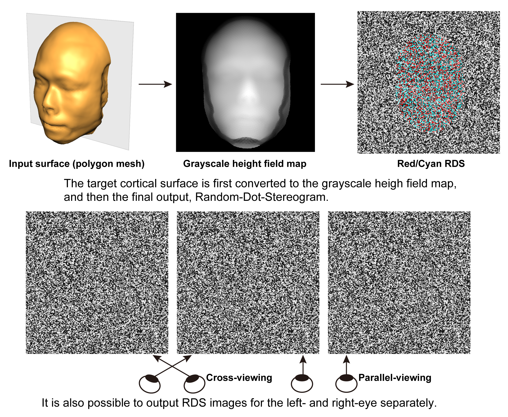

# **README on StereogramFromHeightField**

Created    : "2010-12-03 11:50:05 banh"

Last Update: "2021-06-18 15:54:28 ban"

**********

# <a name = "Menu"> **StereogramFromHeightField -- RDSs from Height-field images** </a>

This **MATLAB** package contains simple sample codes to generate a Red-Green/Red-Cyan/Left-and-Right-separated Random-Dot-Stereogram (RDS) image from an input height-field map (where pixel-by-pixel heights aer represented by pixel-by-pixel values in graysclale, e.g brighter is higher). The main script is  

**~/StereogramFromHeightField/heightfield2RDS/generateRDS.m.**  

Please simply run it and see whether you can get the RDS from a height field map contained. Please note that, it is not a function but a simple *MATLAB* script, while all the required files are included in this repository, you may have to change some parameters. For instance, if you want to use your own height-field map, Please change #line 22 if you want to process your own height field map. You can also manipulate noise levels in the RDS by changing ***noise_ratio, noise_mean,*** and ***noise_sd*** parameters around #line 50-. Also, please note that, to reduce a computational load, any dot density (#dots per deg^2) bias are not considered to be corrected in this sample codes.  

**Reference**  

The similar procedures were applied in generating the RDS stimuli, which were used as the main visual stimuli in  
**Idy W. Y. Chou, Hiroshi Ban, Dorita H. F. Chang. (2021). Modulations of depth responses in the human brain by object context: Does biological relevance matter? ***eNeuro***, 0039-21.2021; DOI: https://doi.org/10.1523/ENEURO.0039-21.2021 .**
