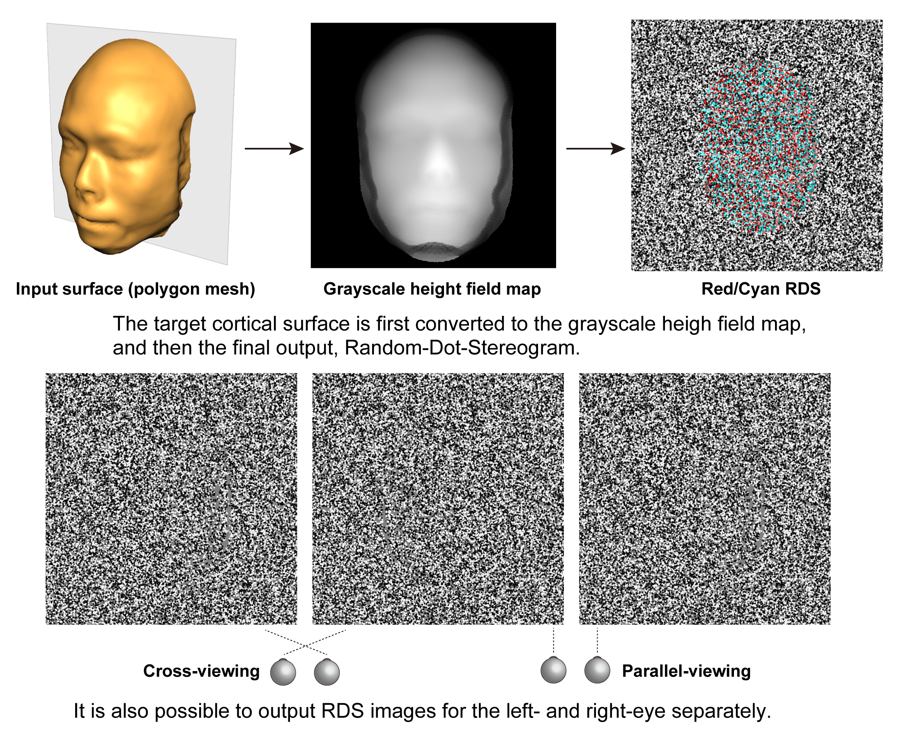

# **README on StereogramFromHeightField**

<div align="right">
Created    : "2010-12-03 11:50:05 ban"<br>
Last Update: "2021-12-13 05:21:26 ban"
</div>

<br>
<div align="center">


<br>
<br>
 
</div>
<br>

***

# <a name = "Menu"> **StereogramFromHeightField -- RDSs from Height-field images** </a>



This **MATLAB** package contains simple sample codes to generate a Red-Green/Red-Cyan/Left-and-Right-separated Random-Dot-Stereogram (RDS) image from an input height-field map (where pixel-by-pixel heights aer represented by pixel-by-pixel values in graysclale, e.g brighter is higher). The main script is  

**~/StereogramFromHeightField/heightfield2RDS/generateRDS.m.**  

Please simply run it and see whether you can get the RDS from a height field map contained. Please note that, it is not a function but a simple *MATLAB* script, while all the required files are included in this repository, you may have to change some parameters. For instance, if you want to use your own height-field map, Please change #line 22 if you want to process your own height field map. You can also manipulate noise levels in the RDS by changing ***noise_ratio, noise_mean,*** and ***noise_sd*** parameters around #line 50-. Also, please note that, to reduce a computational load, any dot density (#dots per deg^2) bias are not considered to be corrected in this sample codes.  

## **Parameters you can set in generateRDS.m**

Some constant parameters below are set around #line 20-60 in generateRDS. Please change these if required.

```MATLAB
imgfile=fullfile(pwd,'depth_maps','HB_face.srf_smoothed_low_res.png'); % a height (=depth) field map

imsize=[700,700];      % the whole image size to be generated, [row,col]
ipd=6.4;               % inter-pupils distance in centimeter
vdist=65;              % viewing distance in centimeter
pix_per_cm_x=27;       % pixels per centimeter along x-axis (horizontal)
pix_per_cm_y=27;       % pixels per centimeter along y-axis (vertical)
dotDens=7;             % dot density, larger is denser
dotRadius=[0.08,0.08]; % dot radius in deg
colors=[0,255,128];    % dot and background colors in gray-scale, [dot_1, dot_2, background]
oversampling_ratio=3;  % ratio of the image oversampling

% image height (depth magnitude) adjusting parameter
img_height_adj_flg=0;  % 0 or 1. whether adjusting image height. if 0, the height (depth) map is adjusted to be 'max_height' defined below
max_height=20;         % max height of the image in cm, used when the input image is adjusted its size later

% image format, 'redgreen', 'redcyan', or 'separated'
img_mode='separated';%'redcyan';

% noise parameters
% 1. noise_mode   : 'acor' (= anti-correlated noises) or 'snr' (= adding normally distributed depth noises)
% 2. noise_ratio  : used for both anti-correlated and SNR RDS images, percentage of noise dots, 0-100%.
% 3. noise_mean   : only used for SNR noise RDS images, mean of the noise in centimeter.
% 4. noise_sd     : only used for SNR noise RDS images, SD of the noise in centimeter.
% 5. noise_adding_method : how to put noises, 'add' or 'replace'.
%                   'add' adds noises on the baseline depths (e.g. face surface),
%                   while 'replace' replaces the baseline depths with the noise depths.

noise_mode='snr';
noise_ratio=0;
noise_mean=0;
noise_sd=2;
noise_adding_method='replace';
```


## **Reference**  

The similar procedures were applied in generating the RDS stimuli, which were used as the main visual stimuli in  
**Idy W. Y. Chou, Hiroshi Ban, Dorita H. F. Chang. (2021). Modulations of depth responses in the human brain by object context: Does biological relevance matter? ***eNeuro***, 0039-21.2021; DOI: https://doi.org/10.1523/ENEURO.0039-21.2021 .**


## **License**  

<br>

StereogramFromHeightField -- RDSs from Height-field images. Copyright (c) 2010 Hiroshi Ban. All rights reserved.  

Redistribution and use in source and binary forms, with or without modification, are permitted provided that the following conditions are met:  

    * Redistributions of source code must retain the above copyright
      notice, this list of conditions and the following disclaimer.
    * Redistributions in binary form must reproduce the above copyright
      notice, this list of conditions and the following disclaimer in
      the documentation and/or other materials provided with the distribution

THIS SOFTWARE IS PROVIDED BY THE COPYRIGHT HOLDERS AND CONTRIBUTORS "AS IS" AND ANY EXPRESS OR IMPLIED WARRANTIES, INCLUDING, BUT NOT LIMITED TO, THE IMPLIED WARRANTIES OF MERCHANTABILITY AND FITNESS FOR A PARTICULAR PURPOSE ARE DISCLAIMED. IN NO EVENT SHALL THE COPYRIGHT OWNER OR CONTRIBUTORS BE LIABLE FOR ANY DIRECT, INDIRECT, INCIDENTAL, SPECIAL, EXEMPLARY, OR CONSEQUENTIAL DAMAGES (INCLUDING, BUT NOT LIMITED TO, PROCUREMENT OF SUBSTITUTE GOODS OR SERVICES; LOSS OF USE, DATA, OR PROFITS; OR BUSINESS INTERRUPTION) HOWEVER CAUSED AND ON ANY THEORY OF LIABILITY, WHETHER IN CONTRACT, STRICT LIABILITY, OR TORT (INCLUDING NEGLIGENCE OR OTHERWISE) ARISING IN ANY WAY OUT OF THE USE OF THIS SOFTWARE, EVEN IF ADVISED OF THE POSSIBILITY OF SUCH DAMAGE.  

The views and conclusions contained in the software and documentation are those of the authors and should not be interpreted as representing official policies, either expressed or implied, of the FreeBSD Project.  
